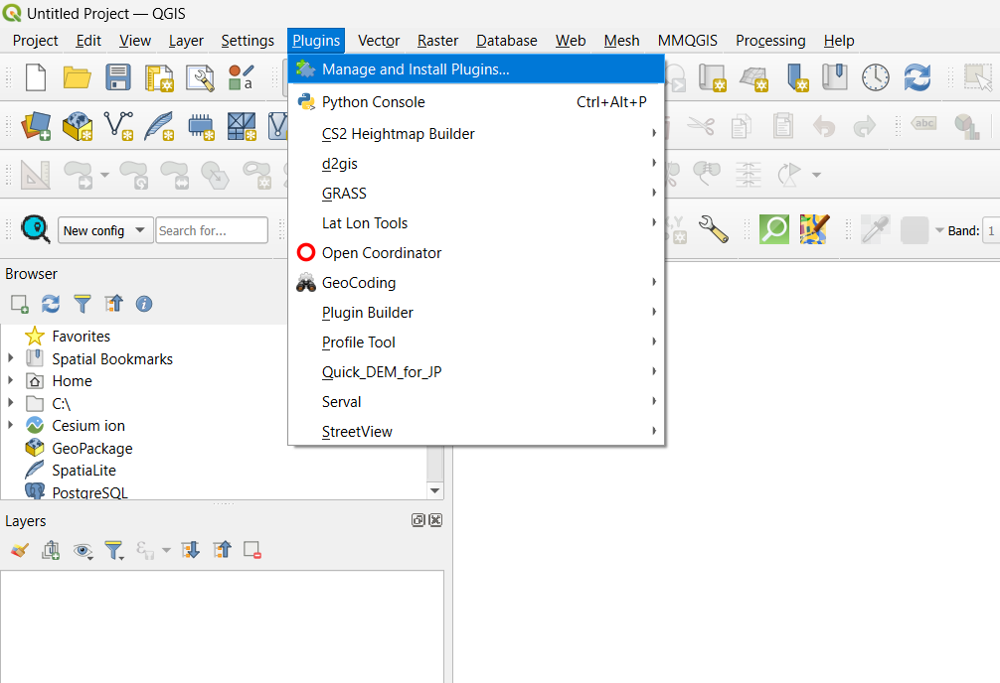
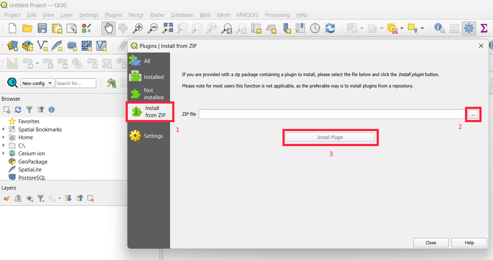
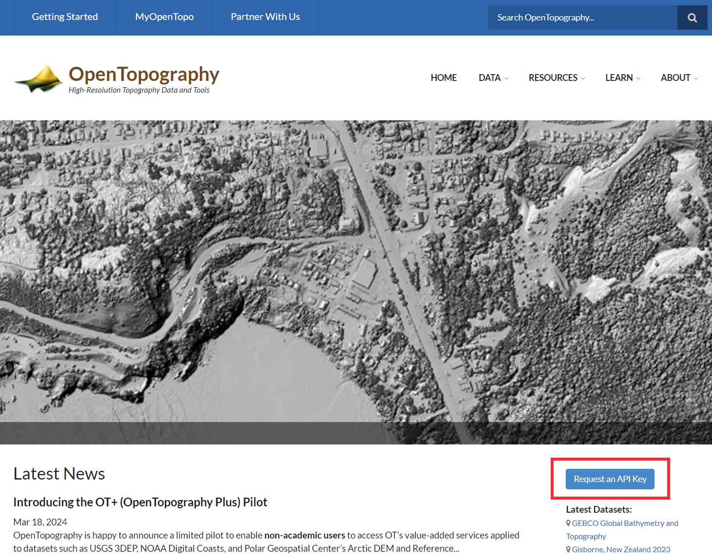
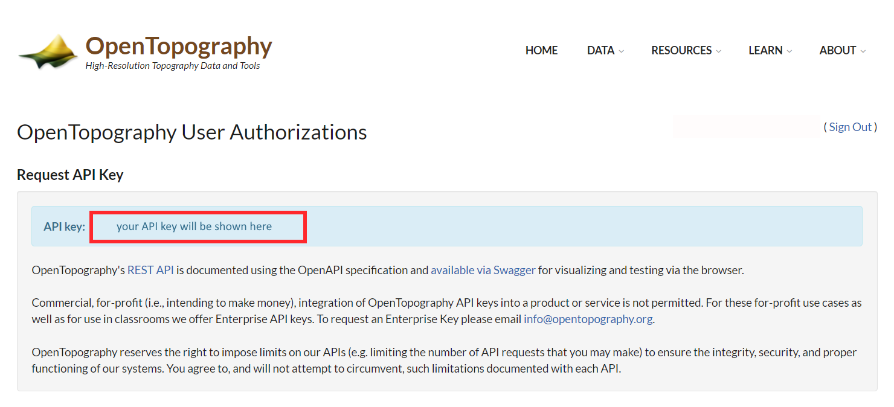
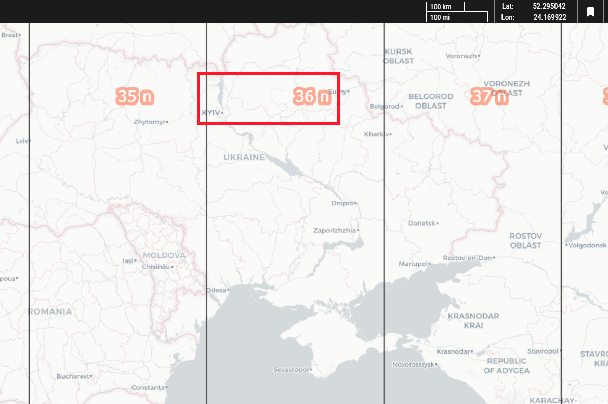
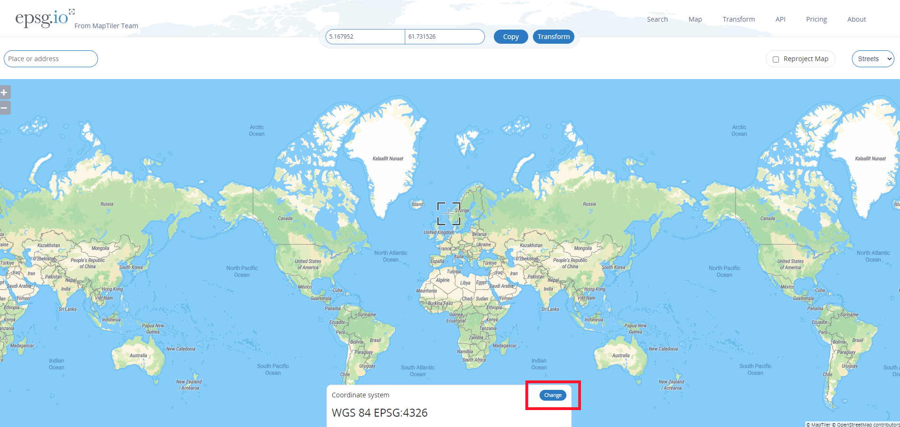
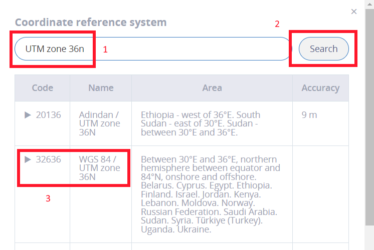
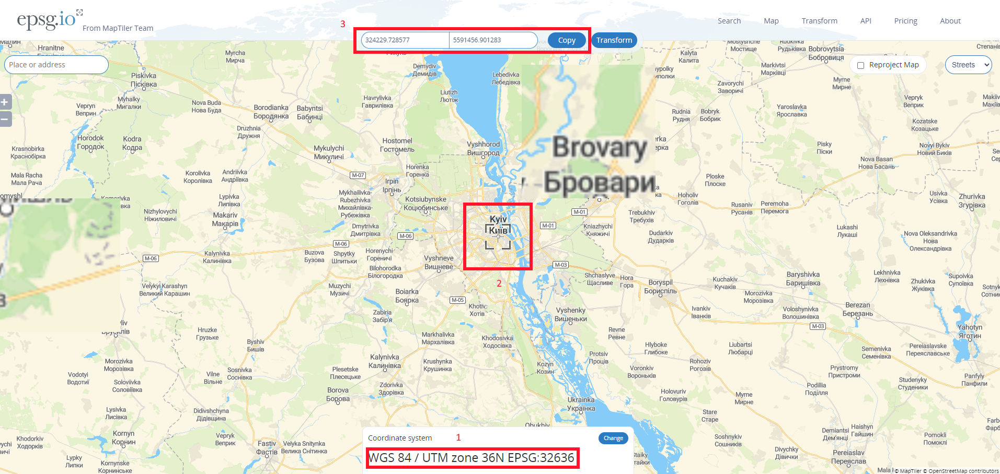

# CSky2TopoCraft: QGIS DEM Downloader & Heightmap Generator
This is CSky2TopoCraft: a QGIS plugin that will allow you to automatically download, format and export realistic heightmaps to the Cities Skylines 2 map editor. It essentially embeds OpenTopography's DEM downloader script into an automation of shanks' tried-and-tested method of heightmap creation, with some modifications and optional processing extensions.

You will need:

The Quantum Geographic Information System (QGIS)

The plugin.

The ability to read.

## Limitations
Note that this tool has been created to provide a convenient pathway for players to make heightmaps for cities outside the United States and other informationally-rich countries (e.g., Switzerland). Users will not be able to use it to download and create heightmaps from the USGS 1-metre DEM data product. It is limited to the global (30M+) products normally accessible through the OpenTopography DEM Downloader plugin.

## Instructions

### Install QGIS
Download and install QGIS from https://qgis.org/en/site/forusers/download.html
### Install Plugin
Download the plugin .zip file from this repository. Open QGIS.

In QGIS:

The plugin will appear listed in the Plugins menu.

### Get OpenTopography API Key
Navigate to https://opentopography.org/ and hit Request an API key to create an account.

Find your API key at: https://portal.opentopography.org/requestService?service=api

### Determine your Coordinate Reference System and Coordinates
#### Step 1
Navigate to https://mangomap.com/robertyoung/maps/69585/what-utm-zone-am-i-in-# and find the UTM zone in which your city falls.

#### Step 2
Navigate to https://epsg.io/map#srs=4326&x=0.000000&y=0.000000&z=1&layer=streets and change the coordinate reference system (CRS) to match your UTM zone. It must be WGS 84 / UTM <number><hemisphere>.

Use the map cross-hairs (2) to determine the coordinates (3) of your city. Note down the EPSG code for your CRS (1).

### Using the Plugin
## Development
Currently in the works:

(1) DSM to DTM Converter.

(2) Experimental Terrain Quality Enhancement Processing Options.

(3) QGIS Map Canvas Visualisations.

(4) Scripting for the automation of CRS identification based on user coordinates.

