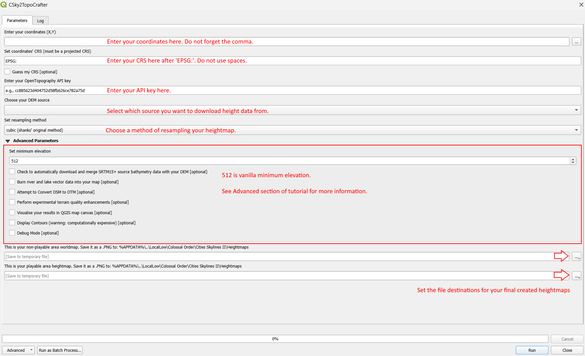

# CSky2TopoCrafter: QGIS DEM Downloader & Heightmap Generator
This is CSky2TopoCraft: a QGIS plugin that will allow you to automatically download, format and export realistic heightmaps to the Cities Skylines 2 map editor. It essentially embeds OpenTopography's DEM downloader script into an automation of shanks' tried-and-tested method of heightmap creation, with some elaboration.

You will need:

A decent CPU.

The Quantum Geographic Information System (QGIS) v3.36+

The plugin.

The ability to read.

## Limitations
Note that this has been created as a convenience tool for players making heightmaps for cities outside the United States and other informationally-rich countries (e.g., Switzerland). Users will not be able to use it to download and create heightmaps from the USGS 1-metre DEM data product. It is limited to the global (30M+) products normally accessible through the OpenTopography DEM Downloader plugin.

## Instructions

### Install QGIS
Download and install QGIS from https://qgis.org/en/site/forusers/download.html
### Install Plugin
Download the plugin .zip file from the releases (tags) section of this repository. Open QGIS.

In QGIS:

Navigate to the correct tab and hit the ellipsis to find the .zip file you just downloaded. Install plugin.

Activate the Processing Toolbox panel.

Your plugin will appear in the Processing Toolbox.

### Get OpenTopography API Key
Navigate to https://opentopography.org/ and hit Request an API key to create an account.

Find your API key at: https://portal.opentopography.org/requestService?service=api

For further information, see https://opentopography.org/blog/introducing-api-keys-access-opentopography-global-datasets

### Determine your Coordinate Reference System and Coordinates
#### Step 1
Navigate to https://mangomap.com/robertyoung/maps/69585/what-utm-zone-am-i-in-# and find the UTM zone in which your city falls.

#### Step 2
Navigate to https://epsg.io/map#srs=4326&x=0.000000&y=0.000000&z=1&layer=streets and hit change. 

Enter your UTM zone in the search box and use the results to change the coordinate reference system (CRS) to match your UTM zone. It must be WGS 84 / UTM zone (number)(hemisphere).

Use the map cross-hairs (2) to determine the coordinates (3) of your city. Note down the EPSG code for your CRS (1).

### Using the Plugin

### Advanced
#### Download and Merge SRTM15+ Source Bathymetry Data
The user can choose to automatically download and merge SRTM15+ source bathymetry data with the DEM. The script initiates the OpenTopography DEM Downloader algorithm. After downloading the bathymetry data, a validity mask is created from the DEM. This mask identifies where the bathymetry data is valid. It checks if the elevation value is equal to 0, indicating areas of no data. These areas are presumed to represent water. The downloaded bathymetry data raster is then reprojected, clipped, and aligned with the DEM data raster. The following expression is used in the Raster Calculator to apply the merge. The expression ensures that where bathymetry data is available, it is used, and where it's not available, the DEM data is retained. 

("A@1" * ("C@1" * ("C@1" <= -1 ) + -1 * ("C@1" > -1))) + (1 - "A@1") * "B@1"

A = Validity Mask\
B = DEM data raster\
C = Bathymetry data Raster

The SRTM15+ has a very low spatial resolution (aprox. 92m @ 15arcseconds). Whilst it will show trends in seabed depths, it does not capture complex seabed features. It also contains terrain data, which creates a problem for coastline delineation since areas where the land transitions into water coincide (are represented by the same pixels). The expression compensates for this by restricting the maximum valid value added from bathymetry layer to -1. Typically, this means that your coastline will be buffered by an immediate seafloor of -1. The inaccuracy of this value is compensated for by the resampling and rescaling processes that take place after the merge and during export.

#### Set Minimum Elevation
The user can set the minimum elevation level. The absolute value of the lowest negative height value, if any, will be added to the user-input value to ensure that the user-input value remains constant. If the resulting minimum elevation is less than 0, it sets it to 0 to ensure that values are valid and that no values are clipped during the GDAL conversion to .png (when values get rescaled). Note that if you set this to zero and you have bathymetry enabled, this will set the minimum elevation of your map to the maximum depth of your seafloor. Also note that the minimum elevation value will determine the kind of texturing that gets automatically applied to your heightmaps in the map editor. The higher your minimum elevation value, the more mountainous it will appear, even if the value ranges are identical. The texturing application appears to be tied to the altitude of your map within the (hypothetical) box drawn by the height scale (0-4096 by default).

#### Burn Rivers and Lakes

UC

#### Convert DSM to DTM

UC

#### Terrain Quality Enhancement Processing

UC

#### QGIS Visualisation
Set this to visualise your map data in the QGIS map canvas. Certain layers of map data involved in the process of heightmap creation will be loaded into QGIS and added to an unexpanded group in the Layers legend panel. The heightmap layer will be set to singleband pseudocolour and given a colour ramp (default 'Spectral'). The worldmap layer will be left as singleband gray. Analytical hillshade and slope layers will then be created for relief and shading purposes. The blending and resampling modes will then be set to multiply and either cubic or bilinear depending on user input for 'Set resampling method'. Both the worldmap buffer and the heightmap buffer will be drawn and symbolised to show the non-playable and playable areas of your finished CS2 map. The opacity of each layer will be tuned for best predictable visual effect.

TODO: coordinate points layer visualisation, custom colour ramp.

#### Display Contours
Toggling this option will create and load a separate layer into QGIS. This layer will display the contour lines according to the height values of your map. The contours are spaced 10 metres apart, with an offset of 1 to delineate the contour of your sea level (effectively your coastline). Note that, depending on your data resolution and your CPU, this algorithm may take some time to complete (perhaps minutes, not seconds). If visualisation is enabled, the layer will be inserted into the produced layers group in the Layers legend panel. The opacity of the contours will be set to 50%.

TODO: Labels, Contour Polygons. 

#### Create Overlays

UC

#### Debug Mode
Self-explanatory. Users can toggle to see increased feedback, but feedback is mostly for development use.

## Why Use CSky2TopoCrafter?
There are a few reasons why you might want to use this program over other programs designed to automate the process of heightmap creation:\
\
(1) Speed: once you've read the tutorial, installed QGIS and the plugin, and understand how to use the plugin, generating heightmaps should be a breeze.\
(2) Accuracy: the QGIS toolset leveraged by the plugin allows for extremely high levels of accuracy. If a 1:1 scale is the goal, this is where your city begins. \
(3) Control: this plugin will become increasingly feature-rich overtime, allowing greater and greater control over the production of heightmaps. See TODO for details.\
(4) Lightweight: owing to OpenTopography's DEM downloader, the filesizes of what you download will be relatively small. No more 1gb+ .tif files.\
(5) Stability: the only intermediary between you and the data provider from whom you're downloading data is OpenTopograhy. As long as OT can get the data, so can you.\
\
Lastly, this plugin is completely free and open source. If you don't like the way the plugin works, you can change it. I won't mind.

## Known Issues
Custom layers created by the user may break the layer ordering and, consequently, styling.\
\
Source DEM and bathymetry rasters are mutually exclusive. Toggling the option to load them together with the option to download bathymetry will load only bathymetry. If users want the source DEM raster, they should leave the option to download bathymetry unchecked.

## TODO:
implement saved input feature\
improve existing visualisations\
map canvas settings integration\
add option to output original DEMs for visualisation\
differentiate user feedback / debug mode\
improve feedback\
implement dynamic filepath identification and saving\
Orfeo scripting for automatic CRS identification\
implement burn rivers/lakes\
try NOAA API\
implement DSM to DTM converter (simple)\
implement experiment terrain quality enhancement processing options (inc. AI-assisted classification)\
implement automatic overlay creation feature\
create Plugin UI

