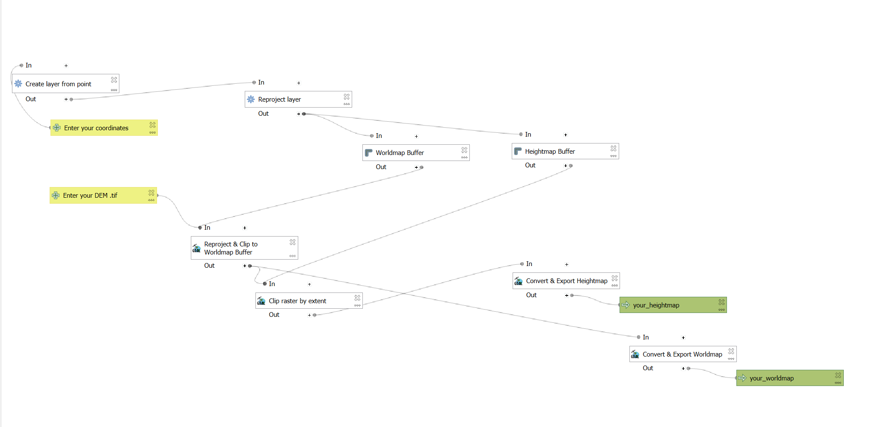

# CSky2TopoCraft: QGIS DEM Downloader & Heightmap Generator

## Instructions

### Install QGIS

### Install Plugin

### Get OpenTopography API Key

### Get Your Coordinates & CRS
#### Step 1
https://mangomap.com/robertyoung/maps/69585/what-utm-zone-am-i-in-#
#### Step 2
https://epsg.io/transform#s_srs=32653&t_srs=32733&x=648329.9881510&y=3870675.5815510 
### Using the Plugin
# Note
